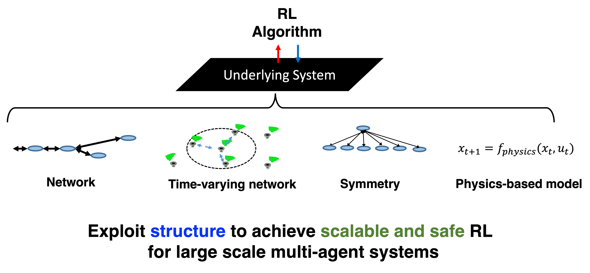
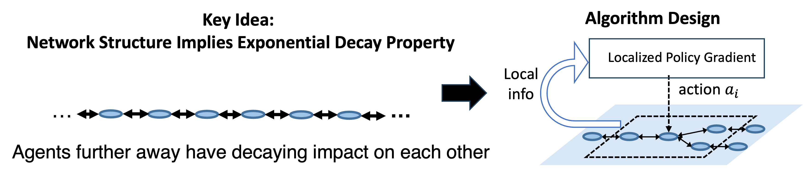
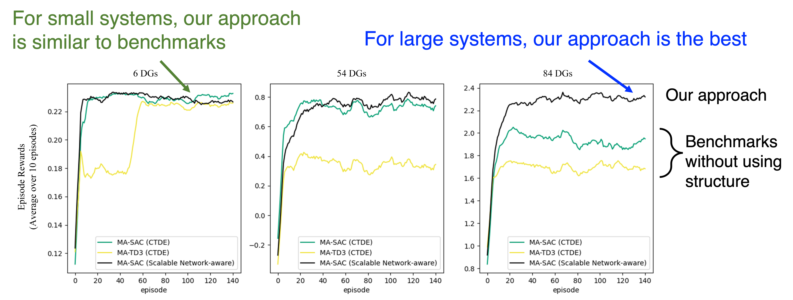
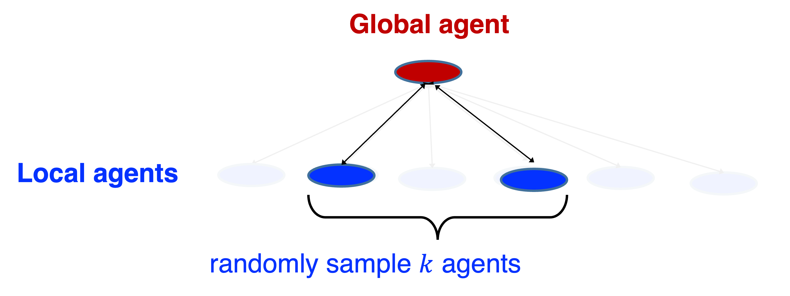
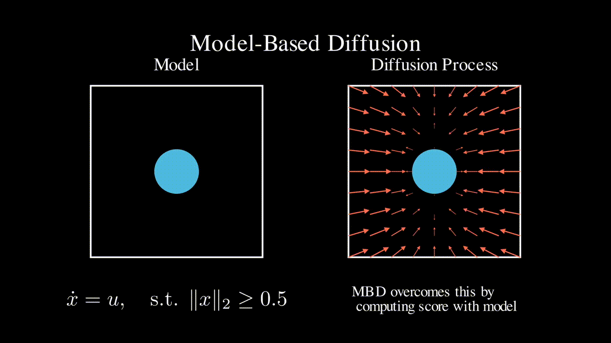

This project is funded as an [NSF CAREER Award](https://www.nsf.gov/awardsearch/showAward?AWD_ID=2339112&HistoricalAwards=false).

## Background and Challenge
Multi-agent networked systems play an indispensable role in advancing our modern society. Examples cut across a broad spectrum, including power grid, transportation systems, networked robots, water/gas distribution systems, 
smart buildings, Internet of Things, etc. The control and operation of such systems have long been a tremendous challenge. The  recent advancement of Machine Learning (ML), particularly Reinforcement Learning (RL), is recognized to hold great potential for revolutionizing such large-scale networked systems. 

However, despite a rich literature on RL and Multi-Agent RL (MARL), (MA)RL algorithms are widely recognized to suffer from scalability, stability, and safety issues when it comes to large-scale networked systems. 
- **Scalability**: Many large-scale systems face the scalability (aka ``curse of multi-agent'') issue, that is, the state space is exponentially large in the size of the system. This can be seen in networked systems like power systems, where the state is the tuple of the local variables (frequency/voltage), and large queuing systems, where the state is the tuple of queue lengths. In both cases, the state space size can be exponentially large in the number of nodes/queues.
- **Safety**: Many real-world problems are subject to stability and safety constraints. For example, power systems must be stable around the nominal operating point and are subject to various constraints like frequency and voltage; queuing systems need to be stable and avoid blowing up the queue length. 

## Proposed Solutions: Structure Exploiting RL
<!--  -->

  

This project takes a unique perspective in addressing the above challenges by **exploiting the underlying structure** to design scalable, stable, and safe MARL for large-scale networked systems. Most of the existing (MA)RL approaches take a black-box view of the underlying system without utilizing the underlying structure. 
In contrast, real-world systems have rich structural properties. In the fast time-scale swing dynamics in power systems, each node's state is directly impacted only by neighbors in the network; the aerodynamic interactions between drones in a drone swarm only happen when they are in close proximity; the load balancing problem in a multiserver system follows a homogeneous structure. 

In light of the above structural properties, *the overarching goal of this project is to develop systematic tools that exploit the underlying structure to design scalable, stable, and safe MARL for large-scale networked systems.* In the following, we introduce several typical structures that we study, including network structure, time-varying network, homogeneity, and physics-based dynamics.  

## Network Structure

  

Network structure, like the topology of the power grid, a transportation network, is a very typical type of structure. Mathematically, the locality structure is reflected in the sparsity of the transition (each agent only impacted by neighbors).
Leveraging such network structure, our work below is able to improve the scalability of multi-agent RL. 

- Guannan Qu, Adam Wierman, Na Li, [Scalable Reinforcement Learning for Multi-Agent Networked Systems](https://arxiv.org/abs/1912.02906), Operations Research 2021.
- Guannan Qu, Yiheng Lin, Adam Wierman, Na Li, [Scalable Multi-Agent Reinforcement Learning for Networked Systems with Average Reward](https://proceedings.neurips.cc//paper/2020/file/168efc366c449fab9c2843e9b54e2a18-Paper.pdf), NeurIPS 2020.
- Yiheng Lin, Guannan Qu, Longbo Huang, Adam Wierman, [Multi-Agent Reinforcement Learning in Stochastic Networked Systems](https://arxiv.org/abs/2006.06555), NeurIPS 2021. 
- Yizhou Zhang\*, Guannan Qu\*, Pan Xu\*, Yiheng Lin, Zaiwei Chen, Adam Wierman, [Global Convergence of Localized Policy Iteration in Networked Multi-Agent Reinforcement Learning](https://arxiv.org/abs/2211.17116), ACM SIGMETRICS 2023.

**Application: Power Systems** 

  

We have also deployed the approach to power sytems frequency control and greatly improved the number of agents that RL can scale up to. 
- Han Xu, Jialin Zheng, Guannan Qu, [A Scalable Network-Aware Multi-Agent Reinforcement Learning Framework for Decentralized Inverter-based Voltage Control](https://arxiv.org/pdf/2312.04371.pdf), arXiv preprint arXiv:2312.04371 (2023).

## Time-varying network

Another typical structure is \emph{time-varying network}, motivated by networked robots where each robot interacts with nearby robots, e.g., aerodynamic interactions between drones. As the locations of the robots can change, the set of nearby robots can be drastically different from step to step, i.e. the network is ``time-varying''.  In the following recent work, we show that is still possible to achieve scalable RL under a specific information structure. 

- Alex Deweese, Guannan Qu, [Interdependent Multi-Agent MDP: Theoretical Framework for Decentralized Agents with Dynamic Local Dependencies](https://arxiv.org/pdf/2406.06823), ICML 2024 

## Symmetry 

  

Consider a power system demand respond program, where a system dispatcher interacts with a large number of individual customers; or queueing systems, where a dispatcher assign jobs to a large number of queues. In all these systems, there are a large number of agents but they all share similar structures and properties. In this of work, we are inspired by the ``power-of-two-choices'' idea in queueing theory and develop a method for MARL that effectively handles the large number of similar agents.

- Emile Anand, Guannan Qu, [Efficient Reinforcement Learning for Global Decision Making in the Presence of Local Agents at Scale](https://arxiv.org/pdf/2403.00222), under review.

## Physics-based model

  

Many engineering systems like power systems and robotics come with a physics-based dynamics model that is derived based on first principles.  In contrast, RL approaches do not assume a specific model class and learns a controller (often times neural network based) in a data driven manner. In this line of work, we seek to leverage such physics-based model to improve the efficiency of RL and ML-based approaches.

- Guannan Qu, Chenkai Yu, Steven Low, Adam Wierman, Exploiting Linear Models for Model-Free Nonlinear Control: A Provably Convergent Policy Gradient Approach ([link](https://arxiv.org/pdf/2006.07476)), IEEE CDC 2021. 

- Chaoyi Pan*, Zeji Yi*, Guanya Shi+, Guannan Qu+, [Model-Based Diffusion for Trajectory Optimization](https://arxiv.org/pdf/2407.01573), preprint 2024. (* denotes equal contribution, + denotes equal advising)

